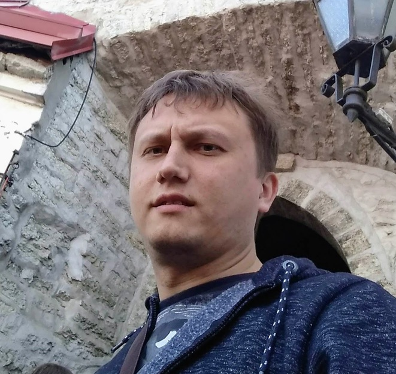

## Kobleneu Yauhen

## 	◼️ Contacts
* Phone number - +375 44 781 67 05
* [Mail](koblenev88@mail.ru)
* [Skype](https://skype:xtcnz181988)
* [Viber](https://viber://chat?number=%2B375447816705)
* [Telegram](https://t.me/Xtcnz181988)
* [GitHub](https://github.com/Xtcnz181988)
## ◼️ Can I introduce myself? 
Hello, everyone! My name is Yauhen. I'm from Minsk. I graduated from Sukhoi State Technical University of Gomel. Speciality: Power Engineering. I work as a senior engineer of the project in a construction company. My main responsibility is to create automatic process control systems and emergency protection of technological processes. I was always interested in programming and now I would like to change my occupation. That's why I joined the online course for front-end developers "RS School".
## ◼️ Skills
* HTML, CSS
* JS Basic
* Git
* Object Pascal
## ◼️ Example of My Code
```
function capitalizeWord(word) {
  const Word = word[0].toUpperCase() + word.slice(1);
  return Word;
   ```
  
## ◼️ Experience
I have a little experience in Java and Object Pascal.

## ◼️ Education
* [Code-basics](https://code-basics.com/ "Code-basics link")
* [HTML academy](https://htmlacademy.ru/profile/id1977165 "Link in Profile")
## ◼️Languages
My english level is A2 (["EF SET Certificate"](https://www.efset.org/cert/8iehBU)).
I continue to study at English school - Skyeng.